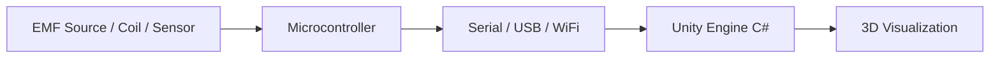
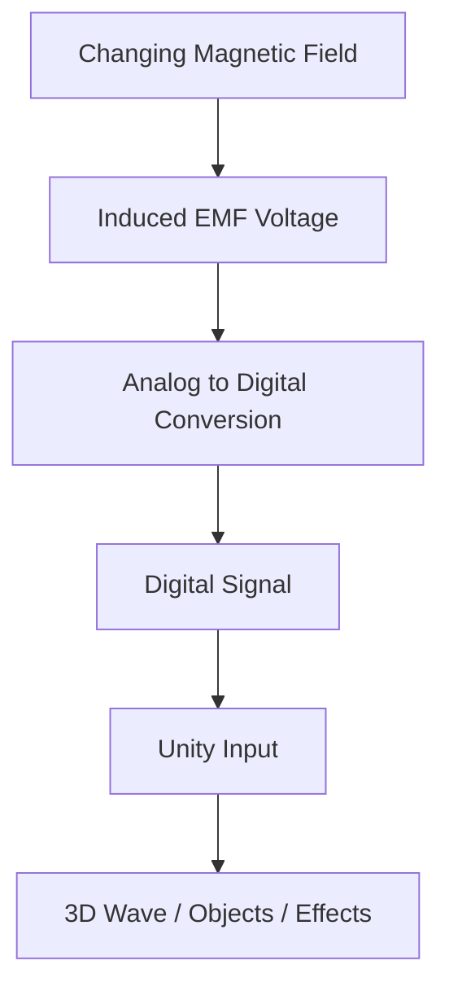
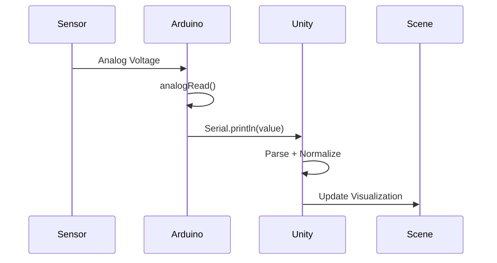

# EMF + Alternating Current + Unity 3D Visualization (Arduino Integration)

## Overview

This project combines:

* **Electromotive Force (EMF)** concepts
* **Alternating Current (AC)** behavior
* **Hardware data acquisition (Arduino or alternatives)**
* **Real-time visualization in Unity (C# 3D)**

The goal is to measure or simulate EMF/AC signals and visualize them dynamically in a 3D Unity environment.

---

## System Architecture

### High-Level Diagram

GitHub Mermaid can be picky about inline line breaks inside node labels, so this version uses simpler labels for compatibility.



---

### Signal Flow Diagram



---

### Data Pipeline Timing



---

## Hardware Options

### 1. Arduino (Recommended Starter)

* Arduino Uno / Nano / Mega
* Reads analog voltage (EMF signal)
* Sends data via Serial (USB)

### 2. ESP32 (Better Performance)

* Built-in WiFi + Bluetooth
* Higher resolution ADC
* Wireless streaming

### 3. DAQ Devices (Advanced)

* High precision acquisition

---

## EMF & AC Concepts (Quick Reference)

### EMF

* Voltage generated by changing magnetic fields

### Alternating Current (AC)

```
V(t) = Vmax * sin(ωt)
```

---

## Arduino Example Code

```cpp
const int sensorPin = A0;

void setup() {
  Serial.begin(9600);
}

void loop() {
  int value = analogRead(sensorPin);
  Serial.println(value);
  delay(10);
}
```

---

## Unity Setup (C#)

### Serial Communication

```csharp
using System.IO.Ports;
using UnityEngine;

public class SerialReader : MonoBehaviour
{
    SerialPort sp = new SerialPort("COM3", 9600);
    public float value;

    void Start()
    {
        sp.Open();
        sp.ReadTimeout = 50;
    }

    void Update()
    {
        if (sp.IsOpen)
        {
            try
            {
                value = float.Parse(sp.ReadLine());
            }
            catch {}
        }
    }
}
```

---

### Visualization Example

```csharp
using UnityEngine;

public class EMFVisualizer : MonoBehaviour
{
    public SerialReader reader;

    void Update()
    {
        float scaled = reader.value / 1023f;
        transform.position = new Vector3(0, scaled * 5f, 0);
    }
}
```

---

## Visualization Ideas

* 3D sine wave mesh
* Particle systems reacting to EMF
* Magnetic field lines
* Oscilloscope UI

---

## Example System (Hypothetical Scene)

### Description

A user moves a magnet through a copper coil connected to an Arduino.

* The Arduino measures induced EMF
* Data streams into Unity
* A glowing sine wave pulses in real-time
* Particles flow along field lines
* A 3D coil model lights up with intensity based on voltage

---

### Example Illustration (Concept)


---

### (Optional) README Image Placeholder

You can later replace this with a real screenshot:

```

```

Suggested image content:

* Left: real-world coil + Arduino
* Right: Unity window with animated waveform
* Overlay: live voltage graph

---

## Data Flow Tips

* Normalize values (0–1023 → 0–1)
* Smooth noise (moving average)
* Buffer data to avoid jitter

---

## Scaling Up

* Use WebSockets (ESP32)
* Multi-channel EMF sensing
* FFT frequency analysis

---

## Troubleshooting

### No Serial Data

* Check COM port
* Match baud rate

### Noisy Signal

* Improve grounding
* Add filtering

### Unity Freezing

* Avoid blocking reads

---

## Future Extensions

* VR/AR visualization
* ML signal classification
* Remote dashboards

---

## License

MIT License

---

## Contributing

Pull requests welcome.
