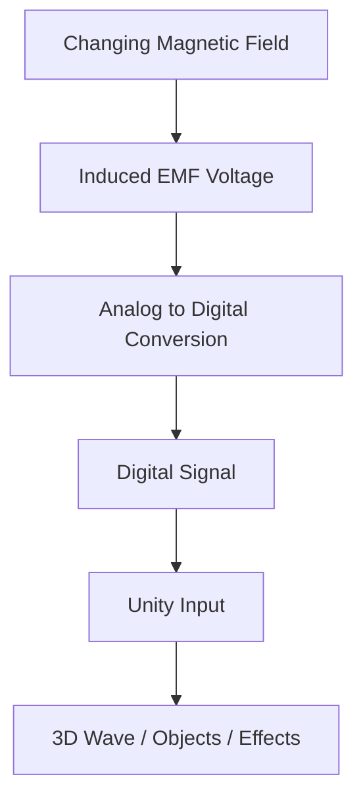
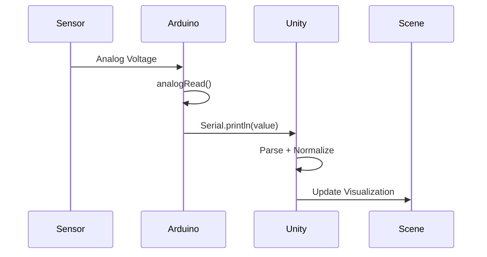

# EMF + Alternating Current + Unity 3D Visualization

**Hypothesis**

**A room wired with alternating current powers ceiling lights, appliances, your personal computer, etc., via the outlets, with or without anything plugged in, EMI/EMF is emitted. Then, a person moves through the room.**

**Due to the electrochemical behaviour of the human brain, such as the sodium ion channels, phosphorus-containing compounds that contribute to the overall magnetic environment of your tissue, static charge deltas to the human brain can be measured leading to electrochemical synapses triggered (similarly to Neuralink although over a distance.)**

--- 

It is also worth exploring the effect of certain sources of light on the human brain.  entering the retina at particular frequencies (AC, LED) with introduced noise or manipulations. I am unable to do accomplish these experiments myself at the current moment. Although fluorescent light doesn't flicker and direct current emits an order of magnitude less EMI than alternating current. The scientific method should be applied here, although not in this article.

--- 

## Overview

* **Electromotive Force (EMF)**
* **Alternating Current (AC)** behavior
* **Data acquisition via hardware (Arduino or alternatives)**
* **Real-time visualization in Unity 3D (written in C#)**
* **References to human biology.**

The goal is to measure or simulate EMF/AC signals and visualize them dynamically in a 3D Unity environment.

---

## Potential System Architecture

### High-Level Diagram

GitHub Mermaid can be picky about inline line breaks inside node labels, so this version uses simpler labels for compatibility.


---

### Signal Flow Diagram



---

### Data Pipeline Timing



---

## Hardware Options
### 1. Arduino (Recommended Starter)

* Arduino Uno / Nano / Mega
* Reads analog voltage (EMF signal)
* Sends data via Serial (USB)

### 2. ESP32 (Better Performance)
"*The ESP32 is a low-cost, low-power system on a chip (SoC) microcontroller designed by Espressif Systems for IoT, wearables, and industrial applications. It features sufficient performance with dual or single-core x86 processors, high speed and extensive GPIOs.*"

* Although built for WiFi + Bluetooth usage, 
The ESP32 can be used to measure both Electromagnetic Fields (EMF) and Electromagnetic Interference (EMI), though its built-in ability is initially limited. For high-precision or professional-grade measurements, you generally pair the ESP32 with external sensors.*

**Alternatively**: a Raspberry Pi CM5 wireless module, then you don't have to worry about the WiFi or Bluetooth interfering with your measurements regardless of disabled or uninstalled. the hardware for those components should be absent.

**EMF measurement (Magnetic Fields)** with ESP32** begins with a built-in Hall effect sensor located behind its metal/plastic lid (a la Tupperware in the fridge). This sensor detects changes in the surrounding magnetic field and can be used for:**

* Proximity: Sensing when a magnet (or something with any amount of magnetism like that barking dog in the NÀSA experiment or the iron in the blood of your veins). Doorknobs, loose change, or your OSHA approved steel toe boots.*

* Basic Magnet Strength: Identifying magnetic poles (North vs. South) and measuring relative field magnitude.*

### 3. Professional Equipment
At academic institutions or laboratories could also be used to accomplish this scientific method. i.e.:

Measuring EMI (Electrical Interference)
can be accomplished via obtaining high-frequency electrical "noise" from the environment. You can build a DIY EMI/EMF detector using:

* Antenna: A simple piece of copper wire or pipe connected to one of the ESP32's Analog-to-Digital pins.

* Circuit Setup: You can experiment with tuning the sensitivities.

* Visualizing Data: The equipment may process these signals and display the intensity an OLED screen ideally powered by DC (the AC of the room you're in could result in introduced noise and the variability of your measurements could be useless. You should shield the wiring with electric tape if you're frugal or use audiophile equipment, although more expensive (e.g.: A professional audio grade C15 connector to a power supply was around 234 dollars.)

## Summary of some potential approaches

| Method [5, 10, 13] | Complexity | Best For |
|---|---|---|
| Built-in Hall Sensor | Very Low | Basic magnet detection, door/window alarms. |
| Simple Wire Antenna | Low | Detecting "live" AC wires in walls or static electricity. |

### 3. DAQ Devices (Advanced)

* High precision acquisition
---

## EMF & AC Concepts (Quick Reference)

### EMF

* Voltage generated by changing magnetic fields

### Alternating Current (AC)

```
V(t) = Vmax * sin(ωt)
```

---

## Arduino Example Code

```cpp
const int sensorPin = A0;

void setup() {
  Serial.begin(9600);
}

void loop() {
  int value = analogRead(sensorPin);
  Serial.println(value);
  delay(10);
}
```

---

## Unity Setup (C#)

### Serial Communication

```csharp
using System.IO.Ports;
using UnityEngine;

public class SerialReader : MonoBehaviour
{
    SerialPort sp = new SerialPort("COM3", 9600);
    public float value;

    void Start()
    {
        sp.Open();
        sp.ReadTimeout = 50;
    }

    void Update()
    {
        if (sp.IsOpen)
        {
            try
            {
                value = float.Parse(sp.ReadLine());
            }
            catch {}
        }
    }
}
```

---

### Visualization Example

```csharp
using UnityEngine;

public class EMFVisualizer : MonoBehaviour
{
    public SerialReader reader;

    void Update()
    {
        float scaled = reader.value / 1023f;
        transform.position = new Vector3(0, scaled * 5f, 0);
    }
}
```

---

## Visualization Ideas

* Skeletal drawing of individuals, minus the infrared requirement (Microsoft Kinect, LiDAR, etc.) while show ling the effect of the lamp powered by alternating current as they walk near it. 
* Magnetic field lines, humidity measurements, voltage regulators for measuring and filling out the interfaces.
---

## Example System
### Description

A person moves through a room wired with alternating current such as potlights and US/CA style outlets (European and Asian style outlets are also subject to this isuue). They emit EMF and due to the electrochemical behaviour of the human brain static charge is present and affected.

## Mitigations
- Compact fluorescent Lighting
- fluorescent tube lighting
- Direct current
- Metal mesh window covers (quite common)
 - An alternative is anti-staticnfikters in front of the windows although they're typically more dense and you receive less sunlight.
- Ground each room of your home such that as you walk through it, whether you're on tile or wood or metal, you're grounded.


* The Arduino measures induced EMF
* Data streams into Unity
* A glowing sine wave pulses in real-time
* Particles flow along field lines
* A 3D coil model lights up with intensity based on voltage

---

### Example Illustration (Concept)


---


